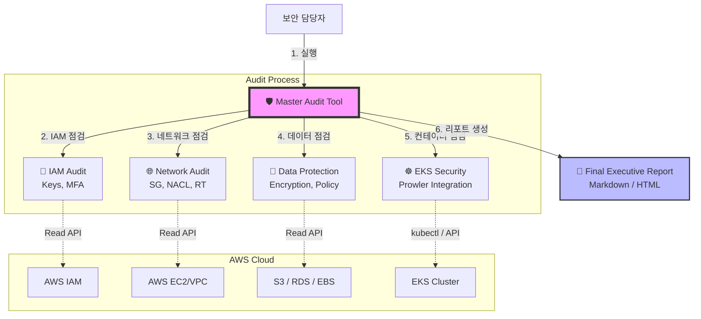

# 🛡️ AWS 통합 보안 진단 도구 (v13)

[SK쉴더스(SK Shieldus) 클라우드 보안 가이드라인(2024)](https://www.skshieldus.com/uploads/files/20240416/20240416180036051.pdf)
을 기반으로 제작한 AWS 인프라 및 EKS 통합 보안 진단 자동화 도구입니다.

**🌐 Language:** [English](readme.md) · **한국어 (Korean)**

**📦 버전 (Versions):**
| 파일 | 언어 | 상태 |
| :--- | :--- | :--- |
| [`master_audit_v13.sh`](master_audit_v13.sh) | Bash (`jq` 필요) | ✅ 전체 진단 (모든 Phase) |
| [`master_audit.py`](master_audit.py) | Python (`boto3`) | 🚧 뼈대 — IAM 완료, 나머지 Phase는 TODO |

---

## 1. 프로젝트 소개 (Introduction)
이 프로젝트는 복잡한 클라우드 보안 점검을 단 한 번의 스크립트 실행으로 자동화하는 도구입니다.
**IAM**(계정), **Network**(방화벽), **Data**(암호화), **EKS**(컨테이너) 등 핵심 보안 영역을
전수 조사하여, 경영진 보고용 요약 리포트와 실무자용 상세 리포트를 자동으로 생성합니다.



#### 🌟 핵심 특징 (Key Features)
* **Zero Impact (무중단):** Read-Only API만 사용하여 운영 중인 서비스에 영향을 주지 않습니다.
* **No Cost (비용 절감):** 유료 로깅 서비스(CloudWatch Logs Insights) 대신 무료 API를 사용하여 비용이 발생하지 않습니다.
* **Cross-Platform:** Linux 및 macOS 환경을 모두 지원합니다.
* **Full Automation:** 리전 내 모든 EKS 클러스터를 자동으로 식별하여 점검합니다.

## 2. 진단 범위 (Audit Scope)
SK쉴더스 가이드라인의 주요 통제 항목을 기준으로 진단합니다.

| 카테고리 (Category) | 코드 (Code) | 진단 내용 (Diagnostic Item) |
| :--- | :---: | :--- |
| **IAM** | 1.8 | 90일 이상 미사용 Access Key 식별 |
| | 1.9 | MFA(멀티팩터 인증) 미설정 계정 탐지 |
| **Network** | 3.1 | 위험 포트(SSH, RDP, DB) 전체 개방(`0.0.0.0/0`) 여부 |
| | 3.2 | 미사용 보안 그룹(Zombie SG) 식별 |
| | 3.3 | 네트워크 ACL(NACL) 커스텀 설정 여부 확인 |
| | 3.4 | 퍼블릭 서브넷(IGW 연결) 및 라우팅 테이블 점검 |
| **Data** | 4.1~3 | EBS, RDS, S3 데이터 암호화 설정 점검 |
| **Availability** | 3.7 | S3 퍼블릭 액세스 차단 설정 확인 |
| | 4.13 | RDS 자동 백업 활성화 여부 확인 |
| **EKS** | 1.11+ | 권한(RBAC), 파드 보안, 로깅 등 심층 진단 (Prowler 연동) |

## 3. 설치 및 실행 (Installation & Usage)

### 3.1 사전 요구 사항 (Prerequisites)
이 스크립트는 아래 도구들을 사용합니다. 미리 설치해주세요.
* `aws-cli` (v2 권장)
* `jq` (JSON 파싱 도구)
* `prowler` (보안 진단 도구)
* `kubectl` (EKS 접속용)

**설치 명령어 예시 (Linux):**
```bash
sudo yum install jq -y
pip install prowler
```

### 3.2 실행 방법 (How to Run)
```bash
# 1. 리포지토리 다운로드
git clone https://github.com/YOUR_ID/YOUR_REPO.git
cd YOUR_REPO

# 2. AWS 인증 설정 (조회 권한 필요)
aws configure

# 3. 스크립트 실행
chmod +x master_audit_v13.sh
./master_audit_v13.sh
```

## 4. 결과물 (Output)
실행이 완료되면 `Total_Audit_Result_날짜` 폴더가 생성됩니다.

| 파일 (File) | 설명 (Description) |
| :--- | :--- |
| `0_FINAL_EXECUTIVE_REPORT.md` | **[핵심]** 경영진 보고용 요약 리포트 |
| `1_IAM_Compliance.md` | 계정 보안 상세 결과 |
| `2_Network_Security.md` | 네트워크 보안 상세 결과 |
| `3_Data_Protection.md` | 데이터 암호화 상세 결과 (S3 정책 포함) |
| `5_EKS_Audit_All/` | EKS 클러스터별 상세 진단 결과 폴더 |

## ⚠️ 주의 사항 (Disclaimer)
이 도구는 진단(감사) 목적으로만 사용됩니다. 어떠한 리소스도 변경하지 않습니다.
조치를 취하기 전에 항상 결과를 수동으로 검토하시기 바랍니다.
