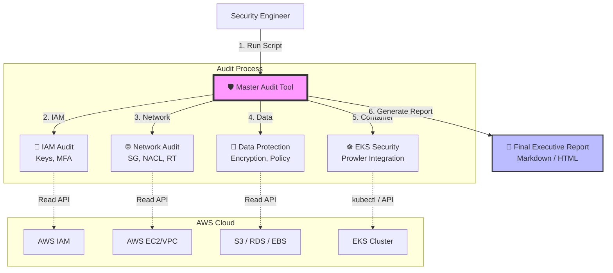

# 🛡️ AWS Integrated Security Audit Tool (v13)

Automated AWS Infrastructure & EKS security audit tool, based on the
[SK Shieldus Cloud Security Guidelines (2024)](https://www.skshieldus.com/uploads/files/20240416/20240416180036051.pdf).

**🌐 Language:** **English** · [한국어 (Korean)](readme.ko.md)

**📦 Versions:**
| File | Language | Status |
| :--- | :--- | :--- |
| [`master_audit_v13.sh`](master_audit_v13.sh) | Bash (needs `jq`) | ✅ Full audit (all phases) |
| [`master_audit.py`](master_audit.py) | Python (`boto3`) | 🚧 Skeleton — IAM done, other phases are TODO |

---

## 1. Introduction
This tool automates the entire cloud security audit process into a single script run.
It performs a comprehensive scan across the core security domains — **IAM** (accounts),
**Network** (firewall), **Data** (encryption), and **EKS** (containers) — and automatically
generates both an executive summary report and detailed reports for engineers.



#### 🌟 Key Features
* **Zero Impact:** Uses 100% Read-Only APIs to ensure no disruption to live services.
* **No Cost:** Avoids expensive logging services (e.g. CloudWatch Logs Insights) by using free-tier APIs and open-source tools.
* **Cross-Platform:** Supports both Linux and macOS.
* **Full Automation:** Automatically detects and scans all active EKS clusters in the region.

## 2. Audit Scope
Diagnostics are based on the key control items of the SK Shieldus guidelines.

| Category | Code | Description |
| :--- | :---: | :--- |
| **IAM** | 1.8 | Detect Access Keys unused for >90 days |
| | 1.9 | Identify users without MFA |
| **Network** | 3.1 | Check for risky ports (SSH, RDP, DB) open to `0.0.0.0/0` |
| | 3.2 | Identify unused Security Groups (Zombie SG) |
| | 3.3 | Check Network ACL (NACL) configurations |
| | 3.4 | Audit Routing Tables & Public Subnets (IGW) |
| **Data** | 4.1~3 | Check encryption for EBS, RDS, S3 |
| **Availability** | 3.7 | Check S3 Public Access Block settings |
| | 4.13 | Verify RDS automated backups |
| **EKS** | 1.11+ | Deep dive into RBAC, Pod Security, Logging (via Prowler) |

## 3. Installation & Usage

### 3.1 Prerequisites
Ensure the following tools are installed:
* `aws-cli` (v2 recommended)
* `jq` (JSON parser)
* `prowler` (security scanner)
* `kubectl` (for EKS access)

**Installation example (Linux):**
```bash
sudo yum install jq -y
pip install prowler
```

### 3.2 How to Run
```bash
# 1. Clone the repository
git clone https://github.com/YOUR_ID/YOUR_REPO.git
cd YOUR_REPO

# 2. Configure AWS credentials (read-only permissions required)
aws configure

# 3. Run the script
chmod +x master_audit_v13.sh
./master_audit_v13.sh
```

## 4. Output Structure
A timestamped folder `Total_Audit_Result_YYYYMMDD` is created:

| File | Description |
| :--- | :--- |
| `0_FINAL_EXECUTIVE_REPORT.md` | **[Key]** Executive summary report |
| `1_IAM_Compliance.md` | IAM account security details |
| `2_Network_Security.md` | Network security details |
| `3_Data_Protection.md` | Data encryption details (incl. S3 policies) |
| `5_EKS_Audit_All/` | Detailed EKS reports per cluster |

## ⚠️ Disclaimer
This tool is for auditing purposes only. It does **not** modify any resources.
Always review the findings manually before taking remediation actions.
